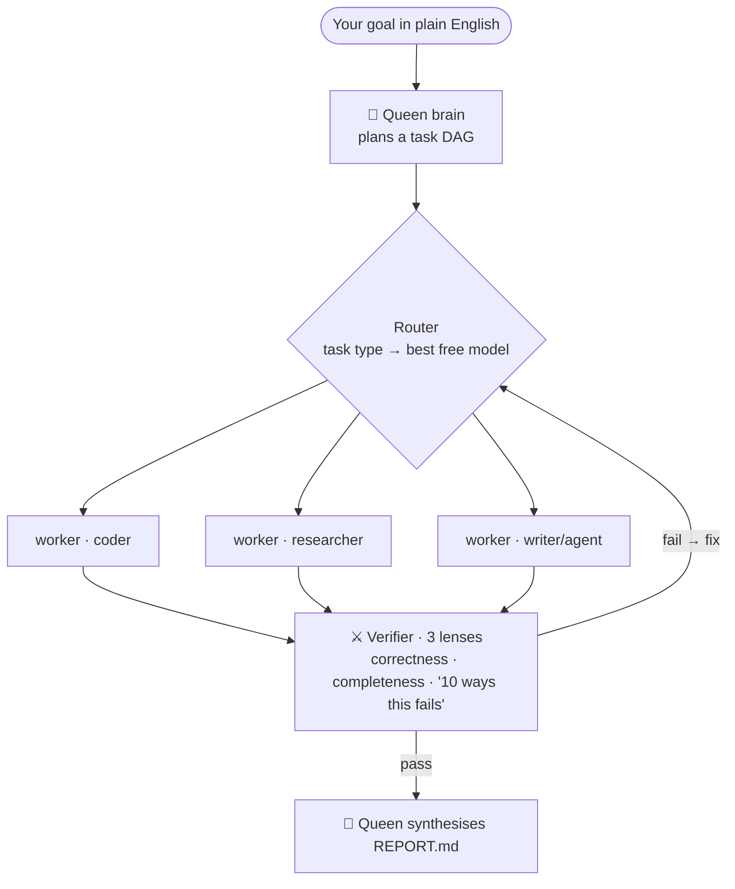

# HIVE 🐝

**One command. A "queen" brain (top model) plans a goal into a task graph, a swarm of cheap/free models executes it in parallel with real file and shell tools, and an adversarial verifier red-teams every result before it's accepted.**

The bet: for a lot of real work, the *scaffold* around the model matters more than the model. HIVE is that scaffold — plan → fan out → verify → synthesise — so a fleet of free models can do work that usually needs an expensive one.



## Run it

```bash
hive "your goal in plain english"     # queen = top model, workers = free stack
hive --dry-run "your goal"            # see the plan, spend nothing
hive --free-brain "your goal"         # brain is free too → £0 run
hive --input ./repo --out ./out "…"   # operate on real files, originals untouched
```

Every run writes to `runs/<id>/`: the plan, per-agent outputs with verify scores, a `workspace/` of real files the agents created, and a synthesised `REPORT.md`.

## How it works

1. **Plan** — the queen decomposes the goal into a JSON task DAG (type, mode, deps, an acceptance test per task).
2. **Route** — each task's type maps to an ordered chain of model aliases; the client escalates down the chain on any error or empty reply.
3. **Swarm** — ready tasks run in parallel. `llm` tasks return a deliverable; `agent` tasks run a tool-loop that actually writes files and runs shell in a sandboxed workspace.
4. **Verify** — three sceptical lenses per result, majority vote; failures go back to the worker with the issue list, up to N fix rounds.
5. **Synthesise** — the queen merges everything into one report.

## Safety — reserved atoms

Spending money, messaging third parties, using credentials, irreversible deletes, publishing. Workers **prepare** these to the last step and queue them for a human tap — never executed automatically.

## Design notes

Stdlib-only Python — no pip installs. Talks to any OpenAI-compatible endpoint (it pairs naturally with [free-ai-stack](https://github.com/aizhigitovamir-code/free-ai-stack) for £0 workers, or point the queen at a stronger model). Concurrency, verifier vote count, and fix-round budget are all in `config.json`.

MIT — see [LICENSE](LICENSE).
